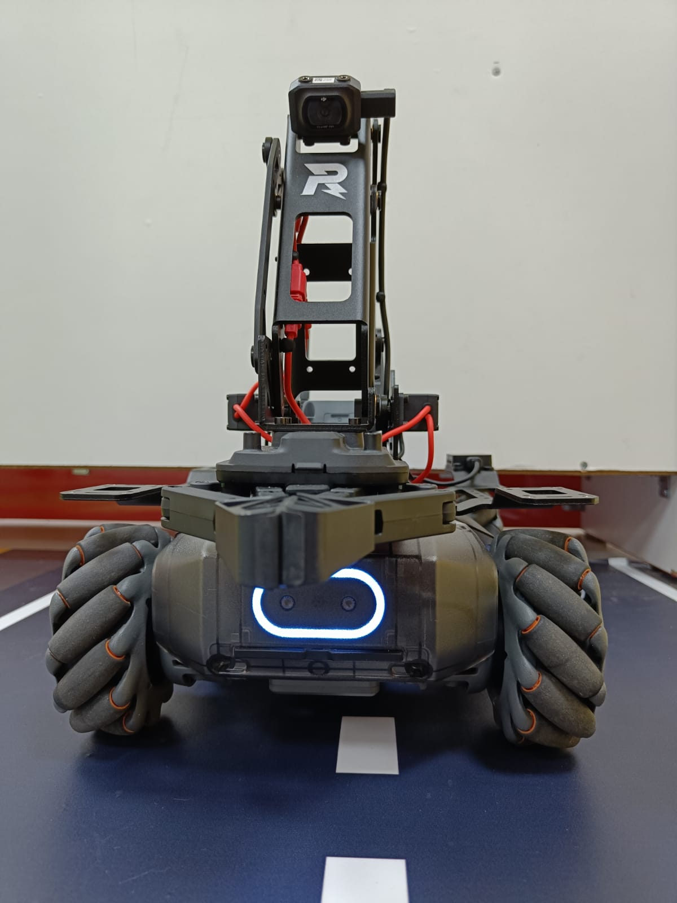
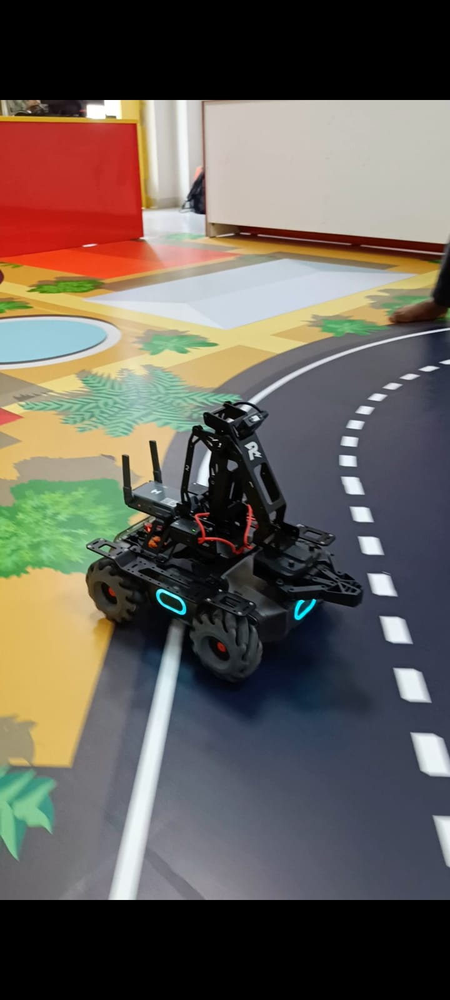

# MobileRobot-Openloopcontrol
## Aim:

To develop a python control code to move the mobilerobot along the predefined path.

## Equipments Required:
1. RoboMaster EP core
2. Python 3.7

## Procedure
Step1:
Initiate the MobileRobot.
<br/>
Step2:
Connect your PC with the MobileRobot.
<br/>
Step3:
Open Python program.
<br/>
Step4:
Program the movements of the robot using python code.
<br/>
Step5:
Execute the python program.
<br/>
## Program
```python
from robomaster import robot
import time

if _name_ == '_main_':
ep_robot = robot.Robot()
ep_robot.initialize(conn_type="ap")

ep_chassis = ep_robot.chassis

'''
x = speed in x direction( meter/second) [-3.5,3.5]
y = speed in y direction( meter/second) [-3.5,3.5]
z = rotation about z axis ( degree/second)[-600,600]
'''
ep_chassis.move(x=3, y=0, z=-0, xy_speed=2).wait_for_completed()
ep_chassis.move(x=0, y=0, z=90, xy_speed=2).wait_for_completed()
ep_chassis.drive_speed(x=0.5,y=0,z=180)
ep_chassis.drive_speed(x=0.5,y=0,z=90)

# ep_chassis.drive_speed(x=0.1,y=0,z=0)
# time.sleep(5)
# ep_chassis.drive_speed(x=2,y=2,z=5)
# time.sleep(5)
# ep_robot.close()
```

## MobileRobot Movement Image:


Insert image here


<br/>

## MobileRobot Movement Video:

(https://youtube.com/shorts/9dcQktqUM0o?feature=share]

## Result:
Thus the python program code is developed to move the mobilerobot in the predefined path.


<br/>
<br/>

```
Mobile Robotics Laboratory
Department of Artificial Intelligence and Data Science/ Machine Learning
Saveetha Engineering College
```
